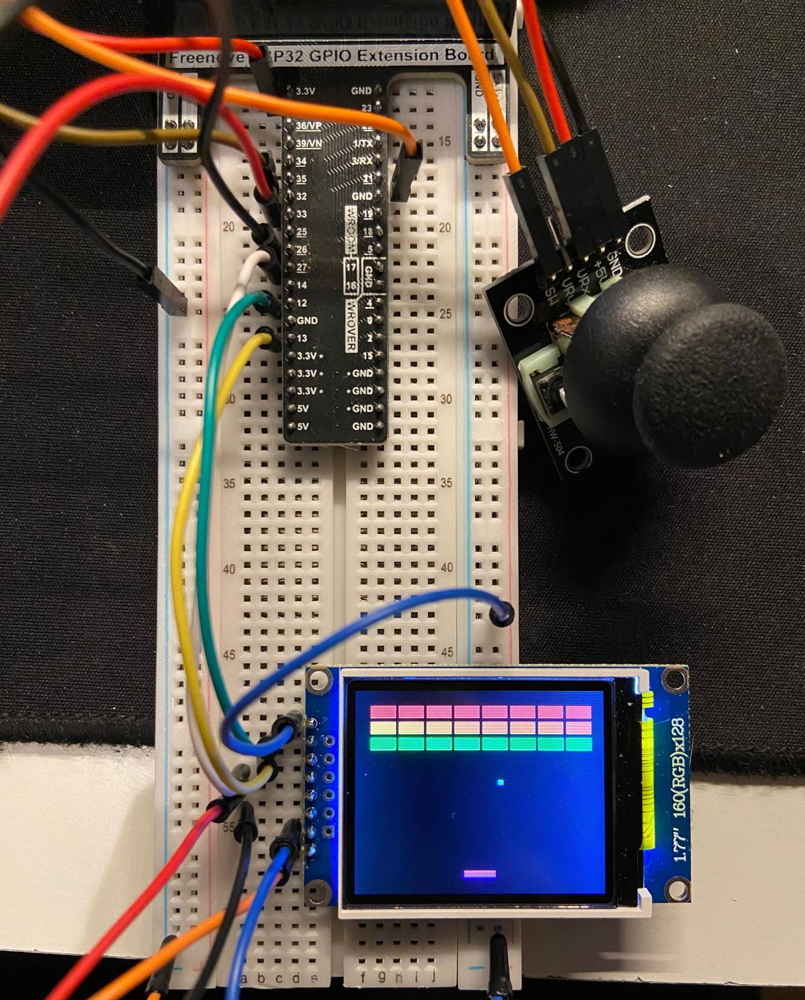

# Breakout Game Project

## Table of Contents
1. [Introduction](#introduction)
2. [Project Structure](#project-structure)
3. [Getting Started](#getting-started)
4. [Gameplay](#gameplay)

## Introduction
This project is a simple implementation of the classic Breakout game using an embedded system. It serves as my first step into the world of embedded development. The game is designed to run on an ESP32 board with an Adafruit ST7735 TFT display and a joystick module. The game is written in C++ and uses the Arduino framework.

## Project Structure

The project consists of the following files:

- [`breakout.ino`](breakout.ino): The main Arduino sketch that initializes the game and runs the main loop.
- [`Game.h`](Game.h) and [`Game.cpp`](Game.cpp): These files contain the `Game` class, which handles the game logic and rendering.
- [`Game_Constants.h`](Game_Constants.h): Defines various constants used throughout the game, such as the number of rows and columns of bricks, paddle height, ball size, etc.
- [`Pins.h`](Pins.h): Defines the pin assignments for the TFT display and input controls.

## Getting Started
To get started with the project, you will need the following hardware components:
- ESP32 board
- Adafruit ST7735 TFT display
- Joystick module

You will also need the Arduino IDE installed on your computer. Follow these steps to set up the project:
1. Clone this repository to your local machine.
2. Open the `breakout.ino` file in the Arduino IDE.
3. Install the required libraries by going to `Sketch -> Include Library -> Manage Libraries` and searching for the following libraries:
   - `Adafruit ST7735 and ST7789 Library`
   - `Adafruit GFX Library`

4. Select the appropriate board and port from the `Tools` menu.
5. Upload the sketch to your ESP32 board.
6. Once the sketch is uploaded, you should see the Breakout game running on the TFT display.

## Gameplay
The game is a simple implementation of the classic [Breakout game](https://en.wikipedia.org/wiki/Breakout_(video_game)). The player controls a paddle at the bottom of the screen and must bounce a ball to break the bricks at the top of the screen. The player loses a life if the ball falls below the paddle. The game ends when all lives are lost or all bricks are destroyed. To start the game, press the joystick button. Use the joystick to move the paddle left and right. Have fun playing!
